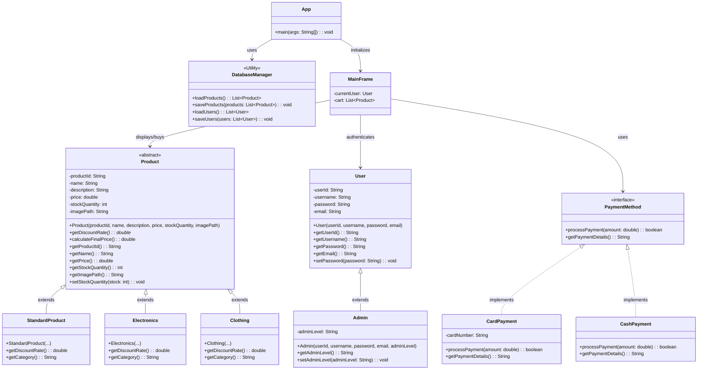

Project Overview: ASTU Store (Java E-Commerce Application)

## 📌 Introduction
The **ASTU Store** is a standalone, desktop-based E-commerce application built entirely in Java. It provides a full shopping experience, including product browsing, a shopping cart, user authentication, and an administrative dashboard. The UI is built from scratch using Java Swing, featuring a modern, clean, and responsive design with a custom `CardLayout` navigation system.

## 🛠️ Tech Stack & Architecture
*   **Language:** Java (JDK 8+)
*   **GUI Framework:** Java Swing & AWT (Custom styled components, dynamic revalidation).
*   **Data Persistence:** File-based Java Object Serialization (`.dat` files). 
    *   *Note: Despite the project folder containing "SQL", the `DatabaseManager.java` currently uses `ObjectOutputStream` to serialize and save `users.dat` and `products.dat` locally.*
*   **Architecture Pattern:** Model-View (Separation of UI components from data models like `User`, `Product`, `Clothing`, `Electronics`).

## 🚀 Core Features

### 1. User Authentication & Role Management
*   **Roles:** Supports both standard **Customers** and **Admins**. Admin accounts get exclusive access to an Admin Dashboard.
*   **Smart UI State:** The application dynamically updates based on the user's login state. If an Admin logs in, the "Admin Panel" button becomes visible. 
*   **Interactive User Menu:** The top right "Guest" / "Username" label acts as an interactive dropdown. Clicking it opens a `JPopupMenu` allowing users to quickly **Login** or **Logout** without cluttering the navigation bar.

### 2. Interactive Storefront
*   **Live Search:** A search bar in the navigation header that filters products in real-time as the user types, using a `DocumentListener`.
*   **Product Grid:** Products are displayed in a responsive grid using custom-styled UI cards. Each card displays product images, stock counts, dynamic pricing, and an "Add to Cart" button.
*   **Polymorphism in Products:** Products are broken down into categories (like `Clothing`, `Electronics`, `StandardProduct`) extending a base `Product` class.

### 3. Shopping Cart & Checkout
*   Users can add items to their cart directly from the storefront.
*   **Stock Validation:** The system checks `stockQuantity` before allowing an item to be added to the cart, preventing overselling.
*   **Authentication Guard:** If a guest tries to add an item to the cart or view the cart, the system intercepts the action and prompts them with a Login dialog first.

### 4. Admin Dashboard
*   Protected route accessible only to users with the `Admin` instance type.
*   Provides a dedicated panel (`AdminDashboardPanel.java`) for managing the store's backend operations.

Below is the UML class diagram for the application's model and core architecture. You can view this directly in GitHub or any Markdown viewer that supports Mermaid.js.

